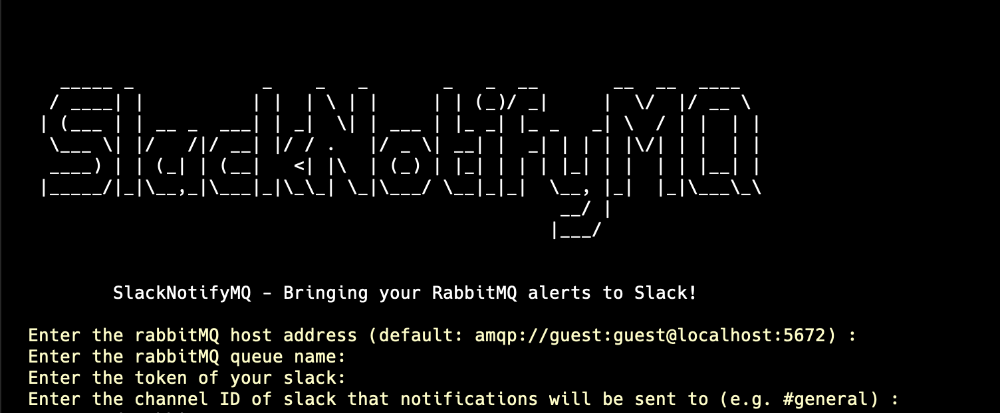

## SlackNotifyMQ

This is cli tool that connects your queue service (rabbitMQ) to your slack. It notifies the channel on slack which you specified when the queue service receives data.




## Requirements

1. Slack token
1. RabbitMQ service

## Installation

You can clone this repository and apply the steps below or you can find the binaries in [releases](https://github.com/root27/slacknotifyMQ/releases) section.

#### Steps

1. Clone the repository

```code

git clone https://github.com/root27/slacknotifyMQ.git

cd slacknotifyMQ

```

2. Install modules

```code

go mod tidy

```

3. Build the application

```code

go build

```

4. Run the application

```code

./slacknotifyMQ

```

## Homebrew

You can also install the application using homebrew.

```code

brew install root27/tools/slackMQ

```

